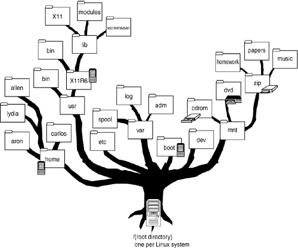

# Class website reminder { .center }

::: {.column-body style="text-align: center;"}
{
    width="30%"
    fig-align="center"
    fig-alt="QR Code link to class website"
}

[aub.ie/icb](https://phyletica.org/intro-to-comp-bio/)
:::


# Topic 2: Intro to Bash

---

<ul>
	<li>
        Most people communicate with their computer through graphical user
        interfaces (GUI)
    </li>
	<li class="fragment fade-up">
        These GUIs are translators
        <ul>
            <li>
                Translates your clicks into instructions
            </li>
        </ul>
    </li>
	<li class="fragment fade-up">
        Works well for simple tasks, but does not scale well
        <ul>
            <li>
                E.g., what if you need to gather info from 1000
                files?
            </li>
            <li>
                Click, click, click &#8230;
            </li>
        </ul>
    </li>
</ul>

---

<ul>
	<li>
        If you vacation in a foreign country, a translator is very helpful
    </li>
	<li class="fragment fade-up">
        But, what if you move to that country for a job in which you interact
        with hundreds of people every day?
    </li>
	<li class="fragment fade-up">
        A translator only gets you so far
    </li>
	<li class="fragment fade-up">
        We want to learn the language used by the GUI to talk (more) directly
        to our computer
    </li>
</ul>

## About these slides

I use "<code>$</code>" at the beginning of lines to signify that we are typing at the
command prompt

```{.bash filename="Bash command line"}
 echo "Hello World!"
```


# Anatomy of a command

---

```{.bash filename="Bash command line"}
echo -e "Hello, World!"
```

::: {.incremental}
`echo`
:   Command (program)

`-e`
:   Option or "flag"

`"Hello, World!"`
:   Argument
:::


---

Precision (spelling, case, and spaces) matters

```bash
$ echo - e "hello"
```

```bash
$ Echo "hello"
```

```bash
$ eco "hello"
```

## Getting help with a command


```bash
$ man echo
```

<ul>
	<li class="fragment fade-up">
        This shows the manual for the <code class="ilcode">echo</code> command
    </li>
    <ul>
    	<li class="fragment fade-up">
            Navigate with arrow keys (or 'j'/'k')
        </li>
    	<li class="fragment fade-up">
            Press 'q' to exit the manual
        </li>
    </ul>
	<li class="fragment fade-up">
        Note, <code>man</code> is the command (program)
        and <code>echo</code> is an argument
    </li>
</ul>


# File System & Paths

---

<figure>
    
    <figcaption><a href="https://flylib.com/books/en/1.295.1.47/1/">flylib.com</a></figcaption>
</figure>

---

```bash
$ pwd
$ ls /
$ ls /home
$ ls /home/jamie
$ ls
```
---

```bash
$ mkdir foo bar
$ cd foo
$ pwd
$ cd ..
$ pwd
$ cd /home/jamie/foo
$ pwd
$ cd ..
```
---

```bash
$ cd foo
$ pwd
$ cd ../bar # same as cd /home/jamie/bar
```

```bash
$ cd
$ pwd
$ cd ~
$ pwd
$ cd $HOME
$ pwd
$ echo $HOME
```

```bash
$ cd foo
$ cd ~/bar # same as ../bar or /home/jamie/bar
```


# What *are* commands?

---

-   They are just programs!
    -   Files on your computer that can be executed


---


```bash
$ which pwd
$ which ls
$ ls
$ /usr/bin/ls
$ which which
```

---

-   The reason you don't have to type `/usr/bin/ls` is because `/usr/bin` is in your `PATH`

```bash
$ echo $PATH
```

-   When you type `ls`, Bash will look for it in these directories


# For loop

---

```bash
$ for x in 1 2 3 4; do echo hello; done
```

```bash
$ for x in 1 2 3 4; do echo $x; done
```

---

Let's make a file with one word in it

```bash
$ echo how > file1.txt
```

Confirm the file now exists and has "how" in it

```bash
$ ls
$ cat file1.txt
```

---

Let's make 2 more files

```bash
$ echo are > file2.txt
$ echo you? > file3.txt
```

---

Let's loop over the files and print their content

```bash
$ for f in file1.txt file2.txt file3.txt; do cat $f; done
```

---

We can use wildcards to make this easier

```bash
$ for f in file?.txt; do cat $f; done
```

```bash
$ for f in f*.txt; do cat $f; done
```

# You are coding!

---

Let's make a file and put some of our commands in it

(I use nano below, but you can use any text editor)

```bash
$ nano my_bash_script.sh
```

Add these lines to `my_bash_script.sh`

```bash
echo "Hello, World!"

for x in 1 2 3 4; do echo $x; done
```

---

Now, you can run `my_bash_script.sh` as a script with Bash!

```
$ bash my_bash_script.sh
```

# Resources 

---

Here's a nice lesson from Software Carpentries

<http://swcarpentry.github.io/shell-novice/>


# Acknowledgments

---

## Support

This work was made possible by funding provided to [Jamie
Oaks](http://phyletica.org) from the National Science Foundation (DEB 1656004).
